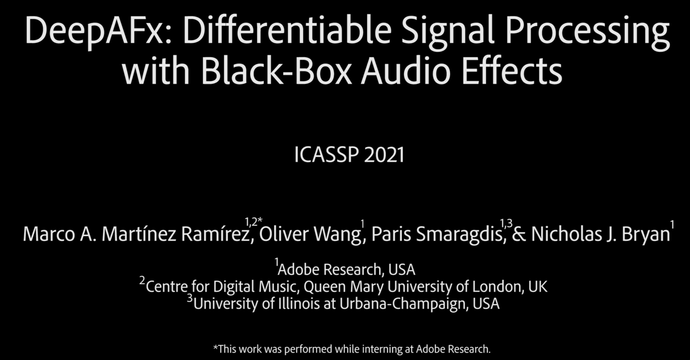

# DeepAFx: Deep Audio Effects 

Audio signal processing effects (FX) are used to manipulate sound characteristics across a variety of media. Many FX, however, can be difficult or tedious to use, particularly for novice users. In our work, we aim to simplify how audio FX are used by training a machine to use FX directly and perform automatic audio production tasks. By using familiar and existing tools for processing and suggesting control parameters, we can create a unique paradigm that blends the power of AI with human creative control to empower creators. For a quick demonstration, please see our demo video:

[](https://youtu.be/6ujkPwcQKo4)

<!--Our goal is to make the process of audio effects control easier and more powerful for audio content creators. To address this, we are investigating how to use deep neural networks/AI to control audio plugins (e.g. VST, AU, LV2 effects) or black-box audio effects, which themselves are used to perform audio processing. By using familiar and existing tools for processing and suggesting control parameters, we can create a unique paradigm that blends the power of AI with human creative control to empower creators.-->


To combine deep learning and audio plugins together, we have developed a new method to incorporate third-party, audio signal processing effects (FX) plugins as layers within deep neural networks. We then use a deep encoder to analyze sounds and learn to control audio FX that themselves performs signal manipulation. To train our network with non-differentiable FX layers, we compute FX layer gradients via a fast, parallel stochastic approximation scheme within a standard automatic differentiation graph, enabling efficient end-to-end backpropagation for deep learning training. 

# Paper 
For technical details of the work, please see:

"[Differentiable Signal Processing with Black-Box Audio Effects.](https://arxiv.org/abs/2105.04752)"
[Marco A. Martínez Ramírez](https://m-marco.com/about/), [Oliver Wang](http://www.oliverwang.info/), [Paris Smaragdis](https://paris.cs.illinois.edu/), and [Nicholas J. Bryan](https://ccrma.stanford.edu/~njb/). 
IEEE International Conference on Acoustics, Speech, and Signal Processing (ICASSP), 2021.

>@inproceedings{martinez2021deepafx,<br />
>   title={Differentiable Signal Processing with Black-Box Audio Effects},<br />
>   author={Mart\'{i}nez Ram\'{i}rez, Marco A. and Wang, Oliver and Smaragdis, Paris and Bryan, Nicholas J.},<br />
>   booktitle={IEEE International Conference on Acoustics, Speech and Signal Processing (ICASSP)},<br />
>   month={June},<br />
>   year={2021},<br />
>   publisher={IEEE}<br />
>}<br />

* Main Project Page: [https://mchijmma.github.io/DeepAFx](https://mchijmma.github.io/DeepAFx)
* ArXiv Paper: [https://arxiv.org/abs/2105.04752](https://arxiv.org/abs/2105.04752)

<!--To update TOC: doctoc --maxlevel 2 README.md -->
<!-- START doctoc generated TOC please keep comment here to allow auto update -->
<!-- DON'T EDIT THIS SECTION, INSTEAD RE-RUN doctoc TO UPDATE -->
<!--**Table of Contents** 

- [Developer](#developer)
  - [Docker Setup](#docker-setup)
  - [Usage](#usage)
- [Custom TF Keras Operators and Gradients](#custom-tf-keras-operators-and-gradients)
  - [License](#license)-->

<!-- END doctoc generated TOC please keep comment here to allow auto update -->

# Developer 

DeepAFX is built using [Tensorflow 2.2.0](https://www.tensorflow.org/versions/r2.2/api_docs/python/tf) for deep learning and [Linux Audio Developer's Simple Plugin API v2](https://lv2plug.in) (LV2) audio effects plugins. LV2 is a royalty-free, open standard for audio plugins for both synthesis, processing, and host applications written in the C programming language.  To bridge the language gap between the LV2 plugins and Python, we use the [lilv](http://drobilla.net/docs/lilv/python/) LV2 library together our own research python pip package called `deepafx`. Our package provides a custom TF Keras layer that internally loads LV2 plugins and does gradient approximation during backpropagation.

## Docker Setup

Given that our work deeply combines python and Linux binaries (i.e. pre-compiled audio plugins), we provide a Dockerfile to fully reproduce our development environment. Docker is a set of tools and ecosystem to develop software in packages called containers, which act as light-weight virtual machines. You can directly use our dockerfile to run a Linux-based containerized development environment on Windows, MacOS, or Linux. 

Our dockerfile builds off of the `tensorflow/tensorflow:2.2.0-jupyter` docker image, adds our necessary LV2 dependencies and installs our `deepafx` python pip package for training and inference. In addition to the default [JupyterLab IDE](https://jupyterlab.readthedocs.io/en/stable/), we also install [code-server](https://github.com/cdr/code-server) into our development environment, which provides a variant of the popular [VS Code](https://github.com/Microsoft/vscode) IDE for development as well.  If you don't like [our Dockerfile](./Dockerfile), you can just use it as a recipe to recreate our development environment elsewhere.


### Build & Run Development Environment

Install [Docker](https://docs.docker.com/get-docker/) and [docker-compose](https://docs.docker.com/compose/install/) on your local system. To verify, make sure you can see a Docker icon in your OS toolbar and/or confirm via running `docker --version` and `docker-compose -v`. Once confirmed, you can 


```
# Clone this repository
git clone http://github.com/adobe-research/deepafx

# Move into git folder
cd <deepafx>

# Build and run the docker image -> container
docker-compose up --build -d

# Specify a shared directory between your local machine and docker to share data
# Note: You can alternatively update the docker-compose.yml to use a Named Volume by 
# changing $DEEPAFX_DATA/:/home/code-base/scratch_space to $data/:/home/code-base/scratch_space
export DEEPAFX_DATA=<path/for/shared/data>

# Run an existing image
docker-compose up 

# Open your IDE of choice
# For VS Code, open a web browser at http://0.0.0.0:8887 (password is dsp)
# For Jupyter, open a web browser at http://127.0.0.1:8888 (password is dsp)

# Within the IDE, open a terminal and navigate to the code within the container
cd /home/code-base/runtime

# Please change the passwords for any remote development.
```

For command line SSH access to the container when running locally, open a second terminal, find the running container id, and enter it

```
docker container ls
docker exec -it <CONTAINER ID> bash
```

Once you open the web IDE or ssh into the container, everything is installed as needed, and you can start using DeepAFX as discussed below. 


## Usage
This repository is intended for educational and research purposes (full license below). We overview downloading our pre-trained models and datasets for our tasks as well as training and evaluating the models. Further below, we also provide several examples on developing TF Keras layers with custom gradients.

### Dataset Download
In this work, we developed three DeepAFX models: tube amplifier emulation (distortion), automatic non-speech sound removal (nonspeech) and automatic music mastering (mastering). For each of these tasks, we have provide scripts to download the necessary datasets to train each model. 

To download all datasets (about 50GB), type:

```
# Within the docker container + deepafx code folder
cd /home/code-base/runtime/deepafx/deepafx
python download.py all

```

Alternatively, to download all datasets individually, type:

```
# Within the docker container + deepafx code folder
cd /home/code-base/runtime/deepafx/deepafx

# Download tube amplifier emulation/distortion dataset
python download.py distortion

# Download the nonspeech dataset
python download.py nonspeech

# Download the mastering dataset
python download.py mastering

# Note the mastering dataset is built on-the-fly and results much change depending on when you run the command.
# The reconstruction is done can also be done individually via:
python download.py mastering --mode download
python download.py mastering --mode align
python download.py mastering --mode resample
python download.py mastering --mode all
```


### Training & Configurations

To train one or more of the models, 

```
# Within the docker container + deepafx code folder
cd /home/code-base/runtime/deepafx/deepafx

# Train the tube amplifier emulation/distortion task
python train_distortion.py

# Train the nonspeech removal tasks
python train_nonspeech.py

# Train the music mastering task
python train_mastering.py
```

These scripts will train for the specifc task and save the trained models, training history, config files and gradient logs (if enabled). The training scripts will also use the evaluate function from `evaluate.py` to test the trained model. The function computes the objective metrics and saves the input, target and output audio samples and the parameter automation. The notebook `notebook_plots.ipynb` plots and saves specific test audio samples and parameter automation curves for a given model.

You can edit the respective training configuration files before training each task, such as selecting the type of encoder, audio plugins, trainable parameters, values of non-trainable parameters, new range of parameters, etc. via editing the following files: `config_distortion.py`, `config_nonspeech.py`, and `config_mastering.py`.


### Evaluation

The script `evaluate.py` allows evaluating a trained model with the test dataset(s). The config file saved from training (numpy dictionary *.params.npy) and the weights (*.h5) are required for this, along with the task name and output directory.

The script receives the following command line positional arguments:
  `task` - string from 'distortion', 'nonspeech' or 'mastering'
  `model_path` - absolute filepath to the model .h5 file.
  `params_path` - absolute filepath to the params.npy file.
  `output_dir` - absolute path to output folder 
  `dafx_wise` (optional) = integer that indicates which audio plugins from the Fx chain are going to be used. For example, for the mastering task; FxChain = Compressor, EQ, Limiter; If `dafx_wise=2` the script will only use the Compressor and the EQ. Useful for testing audio fxchain and progressive training. Default is 0, which means all audio plugins are used.

Examples:

```
# Within the docker container + deepafx code folder
cd /home/code-base/runtime/deepafx/deepafx

# Evaluate 
# Note: Pretrained models can be found /home/code-base/runtime/deepafx/models
python evaluate.py nonspeech </path/to/model>.h5 </path/to/params>.npy /path/to/output/folder

# Evaluate distortion with only output with the first two LV2 plugins in the DSP chain
cd /home/code-base/runtime/deepafx/deepafx
python evaluate.py distortion </path/to/model>.h5 </path/to/params>.npy /path/to/output/folder --dafx 2
```

### Inference

To run our models on any audio file, you can use type:

```
# Within the docker container + deepafx code folder
cd /home/code-base/runtime/deepafx/deepafx

# <task> below can be one of: distortion, nonspeech, mastering
python inference.py <task> --input_file <path/to/input>.wav --output_file <path/to/output>.wav
```


### Notes

- To save the gradient during training, enable the global variable `kLogGradient` from `dafx_layer.py`

- The function `set_param` from the class `Parallel_Batch` doesn't work when using an audio fx chain (`kFxChain=True`) due to threading communication issues. This means that the values for the non-trainable parameters can only be set at the constructor (using values from `config_*.py` and not after the dafx layer is created.

- TODO FIX: The function `layers.compute_time_shifting()` has the argument `samples_delay_max` which corresponds to the max delay we considered as group delay. For the distortion and nonspeech tasks its value is 100 samples. For the mastering task it yields better results as 300 samples (due to the longer group delay of the Fx chain). This change is not happening automatically. 

- The evaluate function from `evaluate.py` and `evaluate_trained_model.py` renders up to 50 seconds from each audio file, but this constant can be changed manually. 

- For the distortion task, the models were trained with an FxChain of Compressor and Limiter (to see whether the Limiter would help to obtain a better matching, it didn't). So when you test these models, add the `--dafx 1` command line argument. This command line arg is not needed for the other ICASSP models. 


# Custom TF Keras Operators and Gradients

At the core of this project is a custom TF keras layer with custom gradients. To develop this, we started with a series of small examples that compared finite different gradients with gradients from automatic differentiation via TF. We then built this up with more complex setups in the examples listed below.

### Examples

* [Example 1: Custom Gradient of Scalar](scripts/custom_grad_example1.py)
* [Example 2: Custom Gradient of Two Scalars](scripts/custom_grad_example2.py)
* [Example 3: Custom Gradient of a Vector and Scalar](scripts/custom_grad_example3.py)
* [Example 4: Custom Gradient of Two Vectors](scripts/custom_grad_example4.py)
* [Example 5: Custom Gradient of Batches of Two Vectors](scripts/custom_grad_example5.py)
* [Example 6: Custom Gradient in Keras Layer](scripts/custom_grad_example6.py)

Once we built this up enough, we moved over to building a custom keras layer that loads an LV2 plugin and approximates the gradient. You can see our custom LV2 TF Keras layer and a very basic toy example below

* [Example 7: LV2 Keras Layer](deepafx/dafx_layer.py)
* [Example 8: Learning to Normalize Toy Example](deepafx/train_toy.py)


## License

Copyright (c) Adobe Systems Incorporated. All rights reserved.

Licensed under [ADOBE RESEARCH LICENSE](./LICENSE).


